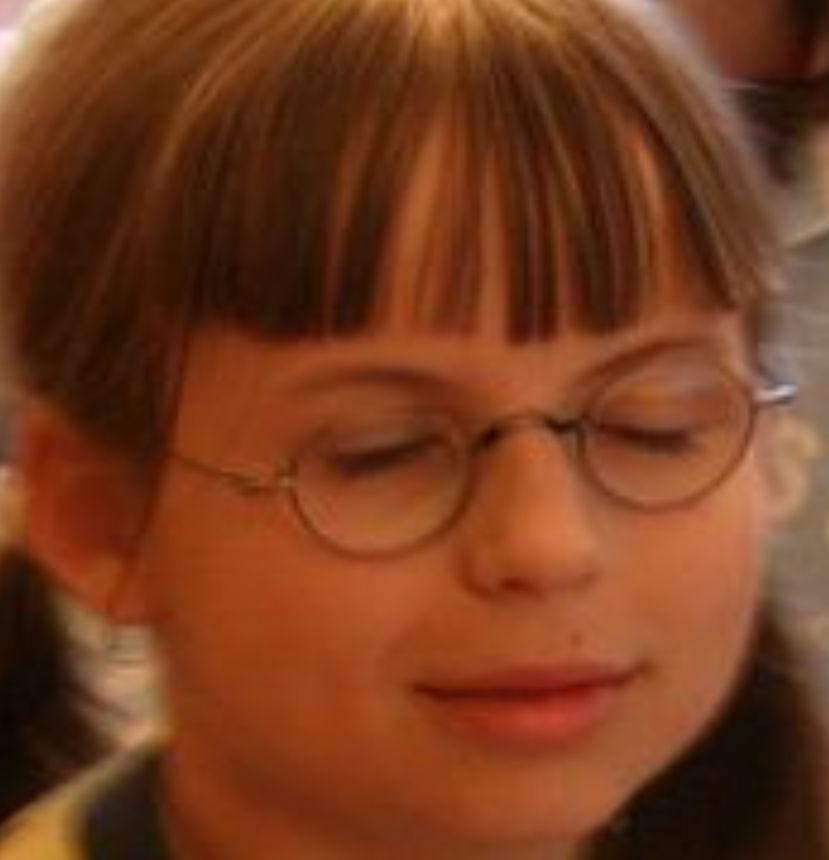

# Tábor 2026 – Zvolenovice 
 
Té mínus třináct 

## Obecné organizační věci
- Základní cena tábora: 7 500 CZK 
  - Affiliate sleva 500 CZK/osoba = doporučil jsem tábor někomu, kdo jede letos poprvé. Souvisí s [marketingem](#marketing).
$$\text{Cena tábora} = \max{\{0,\ 7500 - 500 \cdot (\text{počet doporučení co jedou})\}}\ \text{CZK}$$
<!--
  - Sleva na sourozence je 500 CZK na každého staršího sourozence co jede.
$$\text{Cena tábora} = \max{\{0,\ 7300 - 500 \cdot (\text{počet doporučení co jedou} + \text{počet starších sourozenců co jedou})\}}\ \text{CZK}$$
-->
- Datum konání: 17. 7. (pátek) - 1. 8. (sobota)
- Děti příjezd: 18. 7. (sobota)
  - Rušíme vlak z Jihlavy, nabídneme Budějovice –> Borovany s tím, že by se dětem vzaly věci dodávkou přímo z Budějek
- Děti odjezd: 31. 7. (pátek, časově 15:00-17:00 $\Rightarrow$ OBĚD NAVÍC!) 
  - Rušíme vlak do Jihlavy, nabídneme Borovany –> Budějovice s tím, že by se dětem vzaly věci dodávkou přímo do Budějek
  - Vyhlášení CTH ve čtvrtek před afterparty
  - Kongres v pátek dopoledne

> **Miloš:** *eeee... něco jsem chtěl strašně důležitýho... JO!*  
> Výsedek viz [nákupy](#nákup)

### Termíny

| Co                                           | Kdy                      |
| -------------------------------------------- | ------------------------ |
| Vyhlášení tábora   (termín, cena, plakát) | sobota 20. prosince 2025 |
| Spuštění přihlášek                           | něděle 18. ledna 2026    |
| Odeslání faktur                              | neděle 3. května 2026    |
| Splatnost faktur                             | středa 3. června 2026    |
| Storma                                       | stejně jako loni         |

## Personál
### (Ne)Přítomnost
- Sophi možná bude chybět týden
- Scotty bude týden na WFH/HO/OOO

### Oddíloví vedoucí

| Tým | Vedoucí    |
| --- | ---------- |
| 1   | Štěpán     |
| 2   | Stefi      |
| 3   | Daník      |
| 4   | Alča       |
| 5   | Káťa       |
| 6   | (z)AdeÉek  |
| 7   | malárka    |
| 8   | Béda       |
| 9   | *Maruška?* |
| 10  | *Sophi?*   |

### Ostatní povinnosti
Stejně jako loni.

CTH CEO – Moravák

## CTH

### Brainstorming - Korporátní válka
- Milníky (vypuštění družice, první člověk, ...)
- Museli by si například vymyslet, na čem zbohatnou a na čem postaví vlastní kosmickou agenturu. *Akciové společnosti?*
- Budeme si hrát na Musky/Bezose (💵💵💵🤮)
- Děti budou sbírat kontrakty a plnit je, za to budou získávat bodíky
- Například krabice od kartonu (**KARTONU**) a z nich modely raket a družic apod.
- Různé hodnoticí cíle:
  - Peníze na konci ( $10\cdot\log_{6.9}(\text{peníze})$ )
  - Dostali se na Mars? 
    - 50 b úspěch, 25 b havárie na povrchu, 10 b když se dostali dost daleko, aby doletěli k Marsu, ale minuli
    - Body jsou aditivní - můžou přistát vícekrát
  - V průběhu tábora mohou plnit kontrakty
    - Mohou získat body
    - Mohou získat peníze
    - Mohou získat předměty

---
---

## TODO

### Marketing
- Potenicální možnost je jít za učiteli
- Oslovit Kamču a Toma Michala ohledně Expedice Mars
- Oslovit Marka Miličku a Elen Chochoľakovu ohledně Fykosu
- Jsme největší astronomický tábor ve střední Evropě (hodně to říkat!!!) ❤️
- Oslovit Brno i Prahu hvězdárny

### Úkoly
- Na tábor půjčit dodávku na celých 14 dní
- Kdo má kouli(e), nechť si půjčí přívěs
- Přidat na stránky klauzuli ošetřující, že nelze jet jen na týden či jiný interval jiný, než dva týdny
- Přidat na přihlášku kolonku "Tábor mi doporučil: ___"
- Plakát zajistí grafický tým
- Do 14. prosince nachystat propagační videa (Stefka)
- Zjistit, co s kartama EdenRed benefit či BenefitPlus
  - Zmínit na webu pokud je akceptujeme a popř. jak

### Nákup

- Lavičky a stoly
  - cca. 5 stolů, 12 lavic
  - Navíc i igelitové ubrusy
- Minipočítače s Windowsem
  - Kíťa ví
- Malé promítací plátno (do stanu)
  - Stejné jak máme, ale menší 😘😶‍🌫️
- Kvalitní barlow
- Pláštěnky na dalekohledy

